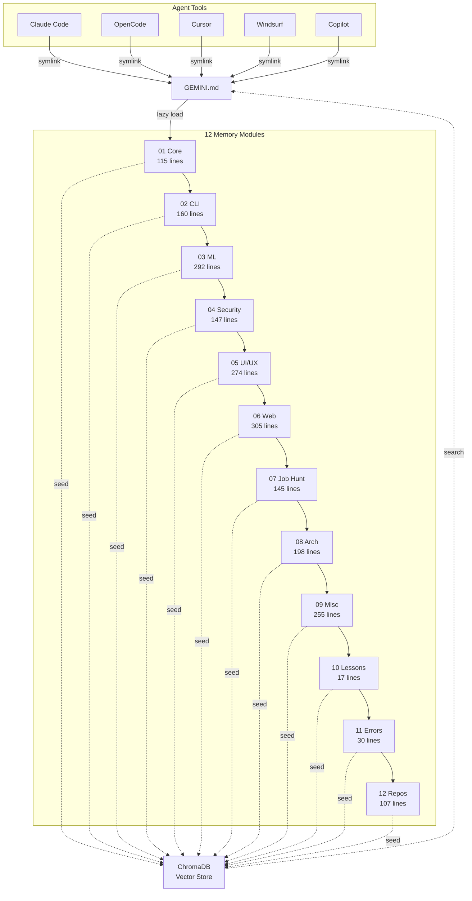

# Architecture

## Overview

MEMORY is a modular, cross-agent knowledge system. A single `GEMINI.md` file routes to 12 on-demand modules via symlinks from 6 AI agents, with a ChromaDB vector store for fast retrieval.



## Core Design Decisions

### 1. Symlink-Based Instruction Injection
**Why:** Six different agent tools (Claude Code, OpenCode, Cursor, Windsurf, Copilot, Cline) each read different filenames for instructions. Symlinks make them all point to the same `GEMINI.md` without duplication.

### 2. Modular On-Demand Loading
**Why:** A single 3,622-line monolithic file consumed 100% of context in minutes. Breaking into 12 modules + lazy loading saves 60-95% of tokens per session.

### 3. Vector DB as Primary Search
**Why:** Loading a 300-line module costs ~1,500 tokens. Searching ChromaDB returns the relevant chunk (~200 tokens) in milliseconds. Modules load only when the search misses.

## Key Components

| Component | Tech | Role |
|-----------|------|------|
| **GEMINI.md** | Markdown | Router/Index — auto-switches lazy↔full mode |
| **12 Modules** | Markdown | Domain-specific instructions loaded on demand |
| **ChromaDB** | Vector DB | Semantic search across all module content |
| **freellmapi** | Node.js | 0-cost LLM proxy (16 providers, 1.7B tokens/mo) |
| **FCC** | Python | Free Claude Code routing to 17 providers |
| **Guardrails** | Shell scripts | 8 CLI wrappers (grep→rg, cat→bat, etc.) |
| **Session Hook** | Shell script | `session-start.sh` — auto-runs every session |

## Data Flow

```
User Request
    │
    ▼
GEMINI.md (routed via symlink from agent tool)
    │
    ├── Lazy path ──► ChromaDB search ──► return chunk (~200 tokens)
    │
    └── Full path ──► Load 01-core-rules.md + 02-cli-tools.md
                      └──► Load task-specific module
                           └──► Execute
                                └──► Verify (semgrep + gitleaks +
                                       pre-commit + symlink check)
```

## Port Map

| Port | Service | Type |
|------|---------|------|
| 3001 | freellmapi API | PM2 permanent |
| 5173 | freellmapi dashboard | On-demand dev |
| 8082 | ChromaDB / FCC admin | Optional |
| 8083 | Dashboard (alt) | Optional |
