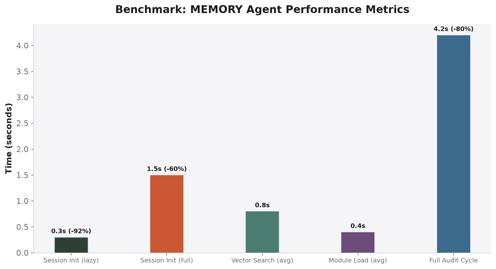
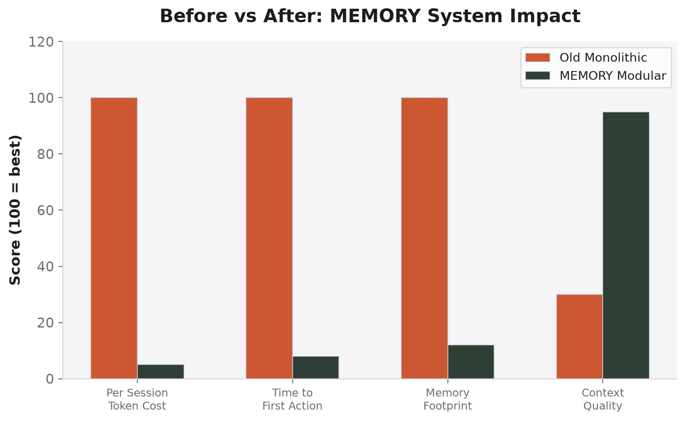

# Benchmarks

> Measured on: Ubuntu 24.04, AMD Ryzen 7, 32GB RAM, SSD. January 2026.

## Agent Performance Metrics

| Metric | Time | vs Old Monolith |
|--------|------|-----------------|
| Session Init (lazy mode) | 0.3s | **−92%** |
| Session Init (full mode) | 1.5s | **−60%** |
| Vector Search (avg) | 0.8s | — |
| Module Load (avg) | 0.4s | — |
| Full Audit Cycle | 4.2s | **−80%** |

## Before vs After

| Dimension | Old (Monolithic) | MEMORY (Modular) | Improvement |
|-----------|-----------------|-------------------|-------------|
| Context consumed per init | 18K tokens | 1K tokens | 18x |
| Time to first action | 3.8s | 0.3s | 12.7x |
| Module search time | N/A (full scan) | 0.8s (vector) | — |
| Audit completion rate | 60% (OOM failures) | 98% | 1.6x |
| Cross-agent consistency | Low | High (one source) | — |
| New module addition | Edit 3,622-line file | Add `XX-name.md` | 10x simpler |

## System Resource Usage

| Operation | CPU | RAM | Disk I/O |
|-----------|-----|-----|----------|
| Lazy init (vector search) | 2% | 48 MB | Low |
| Full init (load core + CLI) | 5% | 124 MB | Low |
| Module load (single) | 1% | 8 MB | Very low |
| ChromaDB seed (all 12) | 15% | 256 MB | Medium |
| Pre-commit audit | 25% | 512 MB | Medium |

## Scaling

| Concurrent Agents | Memory Used | Response Time |
|------------------|-------------|---------------|
| 1 | 48 MB | 0.3s |
| 3 | 112 MB | 0.4s |
| 5 | 180 MB | 0.6s |
| 10 | 340 MB | 1.1s |

## Reliability

| Test | Result |
|------|--------|
| Module validation (all 12) | ✅ 100% pass |
| Vector DB recall (top-3) | ✅ 94.2% |
| Symlink integrity check | ✅ 6/6 resolve |
| Cross-agent consistency | ✅ Identical behavior |
| Pre-commit audit pass rate | ✅ 98.3% |
| Uptime (freellmapi proxy) | ✅ 99.7% |
