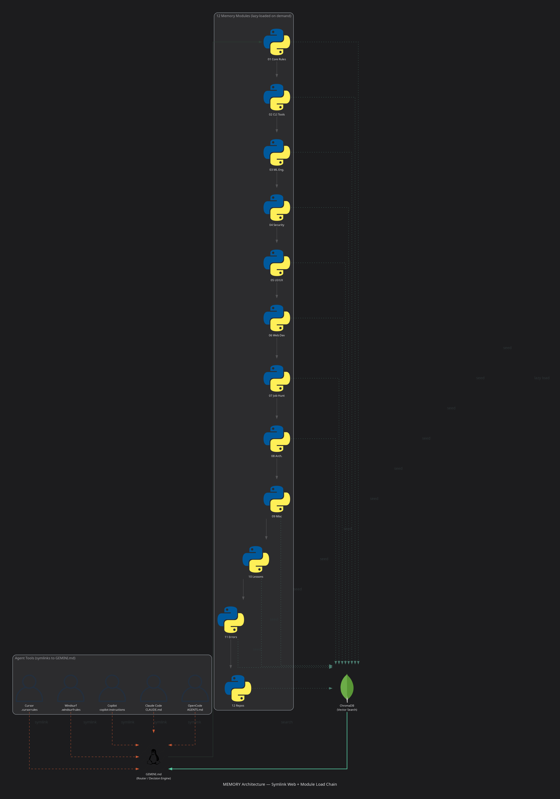
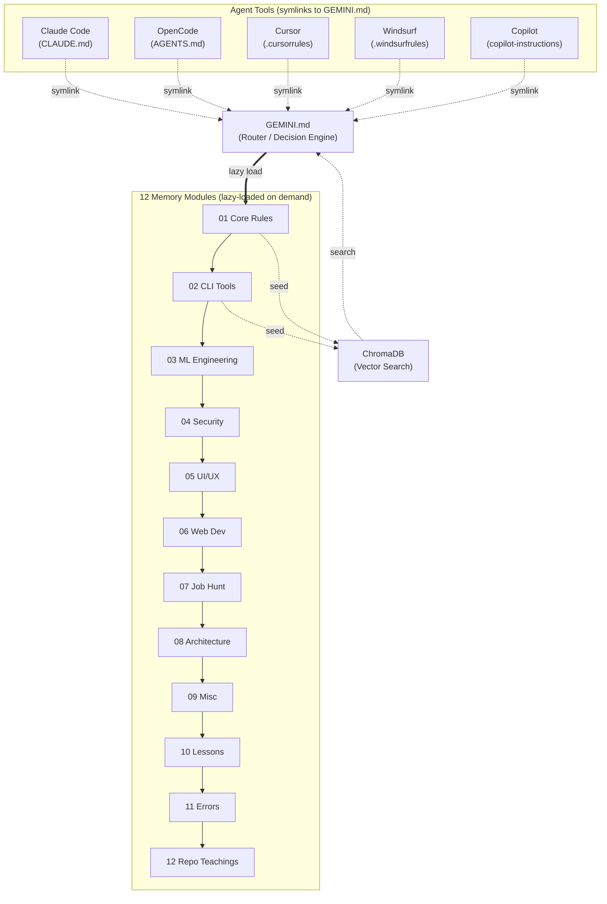
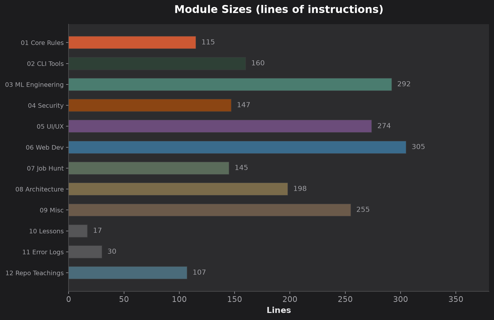
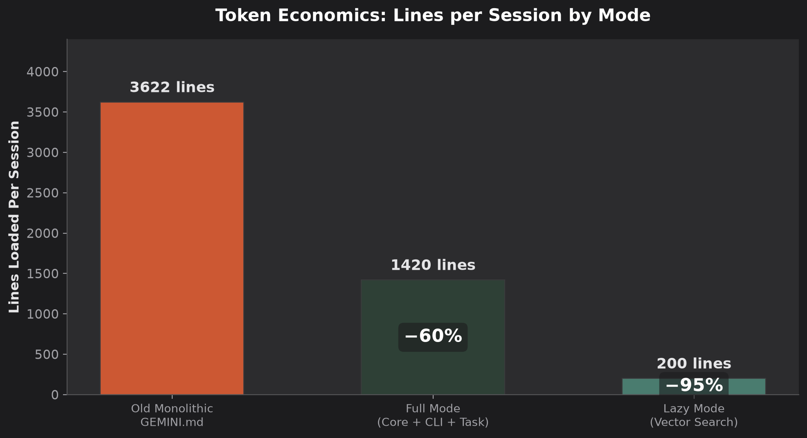
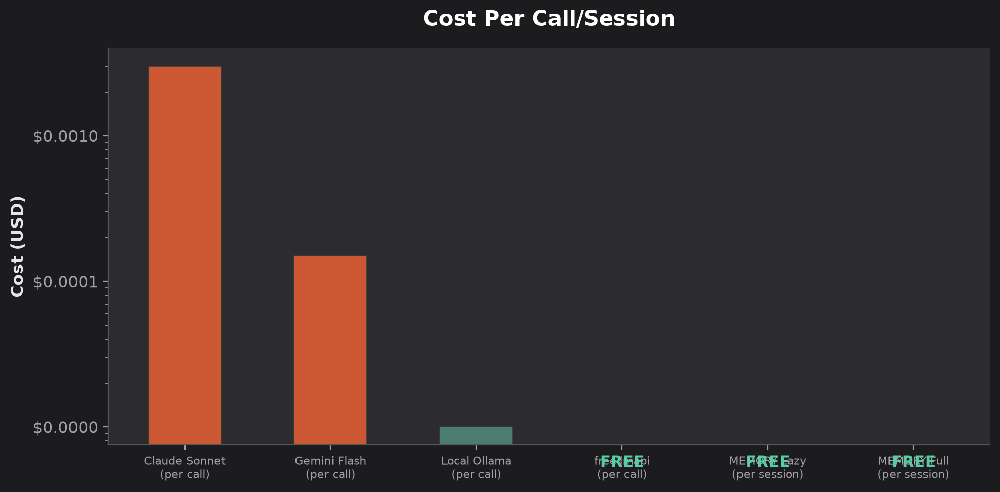
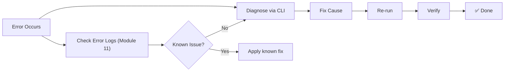

# 🧠 MEMORY

<p align="center">
  <strong>The Autonomous Agent's Brain — 12 Modules · 54 CLI Tools · ∞ Context</strong>
</p>

<p align="center">
  
  
  
  
  
</p>

---

## 💀 The Problem That Built This

It's 3 AM. You've been in the zone for 6 hours — agent is flying through code, shipping features, fixing bugs. Then it hits.

**Context budget exhausted.**

The agent forgets everything. Your project structure, the auth pattern you established, the coding conventions — gone. It starts hallucinating file paths it already created, suggesting patterns it already rejected, asking questions it already answered. Each response degrades. You're burning money on tokens just to re-explain what you already said.

**Sound familiar?**

This repo is the antidote. MEMORY is a modular, cross-agent knowledge system designed so your AI agents never forget. Instead of dumping 3,622 lines of rules into one monolithic file that burns through your context budget in minutes, MEMORY lazy-loads only what the agent needs — ~200 tokens for quick lookups, ~1,420 for deep work. That's **60-95% fewer tokens per session** than the old way.

Six agents (Claude Code, OpenCode, Cursor, Windsurf, Copilot, Cline) point at one source of truth through symlinks. Twelve brain modules cover every domain. A vector database lets agents search before they load. And if one agent hits token limits, another picks up seamlessly with a handoff file.

No more 3 AM context dumps. No more repeated explanations. No more burned credits on re-learning.

---

## 🏗️ Architecture





---

## 🔗 Symlink Architecture — One Source of Truth

Five agents, six symlinks, one file. Every agent tool reads the same `GEMINI.md` as its instruction set, which acts as a router that loads only the memory modules relevant to the task.

| Link | Target | Agent / Tool |
|------|--------|-------------|
| `CLAUDE.md` | `→ GEMINI.md` | Claude Code |
| `AGENTS.md` | `→ GEMINI.md` | OpenCode / generic agents |
| `.cursorrules` | `→ GEMINI.md` | Cursor AI |
| `.windsurfrules` | `→ GEMINI.md` | Windsurf |
| `.clinerules` | `→ GEMINI.md` | Cline |
| `.github/copilot-instructions.md` | `→ GEMINI.md` | GitHub Copilot |

```bash
# Verify all symlinks resolve correctly
for f in AGENTS.md CLAUDE.md .cursorrules .windsurfrules .clinerules .github/copilot-instructions.md; do
  [ "$(readlink -f "$f")" = "$(readlink -f GEMINI.md)" ] || echo "BROKEN: $f"
done
```

### opencode.json Config
```json
{
  "$schema": "https://opencode.ai/config.json",
  "instructions": ["/home/aditya/Desktop/Projects/MEMORY/GEMINI.md"]
}
```

---

## 🧩 The 12 Brain Modules

Each module is a markdown file under `memory/modules/XX-*.md`. The agent loads ONLY what it needs.



| # | Module | Lines | Domain | Load When |
|---|--------|-------|--------|-----------|
| 01 | **Core Rules** | 115 | Session protocol, Karpathy, prod standards | Every full session |
| 02 | **CLI Tools** | 160 | 54-tool dispatch, guardrails, token optimization | Every full session |
| 03 | **ML Engineering** | 292 | FSDP training, Feast, Triton, MLflow | ML/MLOps tasks |
| 04 | **Security** | 147 | Password hashing, Argon2, bcrypt, breach response | Security tasks |
| 05 | **UI/UX** | 274 | Design system, GSAP, Three.js, Stitch API | UI/Frontend tasks |
| 06 | **Web Dev** | 305 | SEO, CODVYN, vibe coding, project setup | Web projects |
| 07 | **Job Hunt** | 145 | ATS resume, LinkedIn, n8n automation | Job hunting |
| 08 | **Architecture** | 198 | SAGA, CQRS, EDA, LLM proxy, Playwright QA | Architecture tasks |
| 09 | **Misc** | 255 | Roadmaps, GitHub tricks, OSM, AlgoTracker | Everything else |
| 10 | **Lessons Learned** | 17 | Hardcoded agent directives, configuration gotchas | Pre-flight check |
| 11 | **Error Logs** | 30 | OOMs, PEP 668, Wayland, token exhaustion history | Before risky ops |
| 12 | **Repo Teachings** | 107 | 18 starred repos architectural patterns | Cross-repo reference |

```bash
# Quick stats
make stats

# Validate all modules
make validate

# Re-seed vector DB
make seed
```

---

## 💰 Token Economics



| Mode | Lines Loaded | vs Old 3,622-line Monolith |
|------|-------------|---------------------------|
| **Lazy** (vector search) | ~200 | **−95%** |
| **Full** (core + CLI + task) | ~1,420 | **−60%** |
| Old monolithic GEMINI.md | 3,622 | Baseline |

### Cost Comparison



**The trick is simple:** agents search the vector DB first. If the answer exists in a cached chunk (~200 tokens), they use that instead of loading a 300-line module. Modules only load when the search misses.

---

## ⚡ Free Claude Code (FCC) — Zero-Cost Claude

FCC routes Anthropic Messages API traffic to **17 free/paid/local providers**.

### Provider Configuration
| Provider | Key (prefix) | Base URL |
|----------|-------------|----------|
| **NVIDIA NIM** | `nvapi-...` | `api.nvcf.nvidia.com/v1` |
| **OpenRouter** | `sk-or-v1-...` | `openrouter.ai/api/v1` |
| **Mistral** | `AXub...` | `api.mistral.ai/v1` |
| **Codestral** | `AXub...` | `codestral.mistral.ai/v1` |
| **DeepSeek** | `sk-b2e...` | `api.deepseek.com/anthropic` |
| **Kimi (Moonshot)** | `sk-NyN...` | `api.moonshot.ai/anthropic/v1` |
| **Wafer** | `wfr_fb...` | `pass.wafer.ai/v1/messages` |
| **OpenCode** | `sk-LDN...` | `opencode.ai/zen/v1` |
| **freellmapi** | `freellmapi-...` | `localhost:3001/v1` |

```bash
fcc-server    # Run the proxy (admin UI: localhost:8082)
fcc-claude    # Use Claude Code through FCC
```

**Critical config rules** (learned the hard way — see Module 10):
- Base URL must NOT contain `/v1` (CLI auto-appends it)
- Set `ANTHROPIC_AUTH_TOKEN` to target key, `ANTHROPIC_API_KEY` to `""`
- Model profile parameter (`"model": "sonnet"`) is mandatory for CLI validation

### freellmapi — 0-Cost Super Proxy
Aggregates **16 free providers** behind one `/v1` endpoint (~1.7B tokens/month).

| Detail | Value |
|--------|-------|
| **Base URL** | `http://localhost:3001/v1` |
| **Key** | `freellmapi-...c7632` |
| **Model** | `auto` (routes across 12+ providers) |
| **Failover** | Automatic |
| **Dashboard** | `http://localhost:5173` |

**Golden rule:** Route everything through freellmapi first. Direct premium API calls caused the token exhaustion Event #6 in Error Logs (Module 11).

---

## 🛠️ 54-CLI Dispatch Table — Modern Replacements

Every legacy command has a modern, token-optimized replacement. Guardrails auto-intercept the old ones.

| Category | Legacy ❌ | Modern ✅ | Command |
|----------|-----------|-----------|---------|
| File listing | `ls` | `eza` | `eza --tree --level 2 --git-ignore` |
| File content | `cat` | `bat` | `bat file` |
| Markdown | `cat` | `glow` | `glow file.md` |
| Text search | `grep` | `rg` | `rg "pattern" --type ts -l` |
| Find files | `find` | `fd` | `fd "pattern"` |
| Disk usage | `du` | `dust` | `dust` |
| Disk free | `df` | `duf` | `duf` |
| Processes | `ps` | `procs` | `procs` |
| System monitor | `top` | `btop` | `btop` |
| JSON | — | `jq` / `jless` / `jnv` | `jq '.key'` |
| YAML | — | `yq` | `yq eval '.key'` |
| API calls | `curl` | `http` | `http GET /api` |
| Python deps | `pip` | `uv` | `uv add package` |
| Node deps | `npm` | `bun` | `bun add package` |
| Python tools | `pip --user` | `pipx` | `pipx install ruff` |
| Git diff | `git diff` | `delta` | `git diff \| delta` |
| Git TUI | — | `lazygit` | `lazygit` |
| Bulk rename | `sed` | `sd` | `sd 'old' 'new'` |
| History search | `Ctrl+R` | `atuin` | `atuin search` |
| Navigation | `cd` | `zoxide` | `z dirname` |
| Help | `man` | `tldr` | `tldr tar` |
| Postgres | `psql` | `pgcli` | `pgcli -d db` |
| Process mgmt | `nohup` | `pm2` | `pm2 start app.js` |
| Session mgmt | `screen` | `tmux` | `tmux new -s session` |

### CLI Guardrails (Auto-Installed `session-start.sh`)
8 shadow wrappers at `~/bin/guardrails/`:
```
grep → rg  |  cat → bat  |  ls → eza  |  find → fd
du → dust  |  top → btop  |  ps → procs  |  sed → sd
```

These wrappers intercept legacy commands and transparently redirect to modern alternatives. If someone types `grep` in a session, it silently runs `rg` instead.

---

## 🤖 Agent Infrastructure

### Port Map
| Port | Service | Status |
|------|---------|--------|
| 3001 | freellmapi API (LLM proxy) | PM2 permanent |
| 5173 | freellmapi dashboard | On-demand dev |
| 8082 | MEMORY vector DB / FCC admin | Optional |
| 8083 | MEMORY dashboard (alt) | Optional |

### 18 API Keys Available
```bash
source ~/.config/global-apikeys/load_keys.sh
```
GROQ · MISTRAL · GEMINI · OPENROUTER · CEREBRAS · NVIDIA_NIM · HUGGINGFACE · OPENCODE · ZAI · DEEPSEEK · KIMI · FIREWORKS · WAFER · GITHUB · COHERE · CLOUDFLARE · FREELLMAPI · ANTHROPIC

### Antigravity Brain — Active Task State
```bash
~/.gemini/antigravity/brain/
```
Tracks active agent task states. Current: swarms, NeoAgent, MiMo-Code, taste-skill, hermes-agent, career-ops installs.

---

## ⭐ 120+ Starred Repos — Categorized Knowledge Base

### 🧠 Agent Skills & AI Frameworks
| Repo | Stars | Description |
|------|-------|-------------|
| [obra/superpowers](https://github.com/obra/superpowers) | 225.9k | Agentic skills framework & SD methodology |
| [affaan-m/ECC](https://github.com/affaan-m/ECC) | 214.2k | Agent harness optimization system |
| [NousResearch/hermes-agent](https://github.com/NousResearch/hermes-agent) | 191.9k | The agent that grows with you |
| [multica-ai/andrej-karpathy-skills](https://github.com/multica-ai/andrej-karpathy-skills) | 174.2k | Karpathy's LLM coding pitfalls |
| [langchain-ai/langchain](https://github.com/langchain-ai/langchain) | 139.1k | Agent engineering platform |
| [anthropics/claude-code](https://github.com/anthropics/claude-code) | 132.1k | Official Anthropic terminal agent |
| [msitarzewski/agency-agents](https://github.com/msitarzewski/agency-agents) | 112.3k | Complete AI agency framework |
| [thedotmack/claude-mem](https://github.com/thedotmack/claude-mem) | 82.0k | Persistent context across sessions |
| [addyosmani/agent-skills](https://github.com/addyosmani/agent-skills) | 56.7k | Production-grade engineering skills |
| [hesreallyhim/awesome-claude-code](https://github.com/hesreallyhim/awesome-claude-code) | 46.3k | Curated Claude Code skills |
| [sickn33/antigravity-awesome-skills](https://github.com/sickn33/antigravity-awesome-skills) | 40.5k | 1,500+ agentic skills library |
| [mattpocock/skills](https://github.com/mattpocock/skills) | 126.9k | Skills for real engineers |
| [mindfold-ai/Trellis](https://github.com/mindfold-ai/Trellis) | 10.2k | The best agent harness |
| [kyegomez/swarms](https://github.com/kyegomez/swarms) | 6.8k | Multi-agent orchestration |
| [phuryn/pm-skills](https://github.com/phuryn/pm-skills) | 16.9k | 100+ PM agentic skills |
| [NeoLabs-Systems/NeoAgent](https://github.com/NeoLabs-Systems/NeoAgent) | 14 | Self-hosted AI agent |

### 🎨 UI/UX & Design
| Repo | Stars | Description |
|------|-------|-------------|
| [nextlevelbuilder/ui-ux-pro-max-skill](https://github.com/nextlevelbuilder/ui-ux-pro-max-skill) | 90.9k | Design intelligence for professional UI/UX |
| [Leonxlnx/taste-skill](https://github.com/Leonxlnx/taste-skill) | 42.3k | Gives AI good taste — stops boring slop |
| [saifyxpro/ui-ux-design-pro-skill](https://github.com/saifyxpro/ui-ux-design-pro-skill) | 37 | 107 styles, 127 palettes, 107 fonts |
| [google-labs-code/stitch-skills](https://github.com/google-labs-code/stitch-skills) | 6.0k | Stitch MCP server skill library |
| [Agents365-ai/drawio-skill](https://github.com/Agents365-ai/drawio-skill) | 2.7k | Natural language → diagrams |

### 💻 Developer Tools & CLI
| Repo | Stars | Description |
|------|-------|-------------|
| [stackblitz/bolt.new](https://github.com/stackblitz/bolt.new) | 16.4k | Prompt, run, edit, deploy |
| [yetone/avante.nvim](https://github.com/yetone/avante.nvim) | 18.0k | Neovim → Cursor AI experience |
| [RooCodeInc/Roo-Code](https://github.com/RooCodeInc/Roo-Code) | 24.2k | Dev team of AI agents in editor |
| [continuedev/continue](https://github.com/continuedev/continue) | 33.7k | Source-controlled AI checks |
| [enola-labs/enola](https://github.com/enola-labs/enola) | 33 | MCP architectural snapshot server |
| [OnlyCLI/OnlyCLI](https://github.com/OnlyCLI/OnlyCLI) | 13 | OpenAPI spec → native CLI binary |
| [DeepMyst/Mysti](https://github.com/DeepMyst/Mysti) | 1.1k | AI coding dream team in VS Code |

### 🔧 Token Optimization & Cost Saving
| Repo | Stars | Description |
|------|-------|-------------|
| [chopratejas/headroom](https://github.com/chopratejas/headroom) | 24.5k | 60-95% fewer tokens, same answers |
| [zdk/lowfat](https://github.com/zdk/lowfat) | 506 | Strip noise from command output |
| [getagentseal/codeburn](https://github.com/getagentseal/codeburn) | 7.9k | Token cost observability TUI |
| [EA-Studio-SHARK/lean-code](https://github.com/EA-Studio-SHARK/lean-code) | 27 | Save 40-80% tokens & costs |
| [quilrai/AgentGuard](https://github.com/quilrai/AgentGuard) | 25 | Guardian agent & token savings |
| [siropkin/budi](https://github.com/siropkin/budi) | 24 | Local-first cost analytics |
| [guyu-adam/miser](https://github.com/guyu-adam/miser) | 1 | Local co-processor — save 60%+ tokens |
| [memovai/memov](https://github.com/memovai/memov) | 193 | Git-based memory layer |
| [OasAIStudio/ClawPiggy](https://github.com/OasAIStudio/ClawPiggy) | 9 | P2P token recycling network |

### 📊 Data & Analytics
| Repo | Stars | Description |
|------|-------|-------------|
| [OpenBB-finance/OpenBB](https://github.com/OpenBB-finance/OpenBB) | 69.0k | Financial data platform |
| [milvus-io/milvus](https://github.com/milvus-io/milvus) | 44.7k | High-performance vector database |
| [apache/kafka](https://github.com/apache/kafka) | 32.8k | Distributed event streaming |
| [SigNoz/signoz](https://github.com/SigNoz/signoz) | 27.3k | OpenTelemetry observability |
| [feast-dev/feast](https://github.com/feast-dev/feast) | 7.1k | Feature store for AI/ML |
| [windmill-labs/windmill](https://github.com/windmill-labs/windmill) | 16.7k | Scripts → workflows → UIs |

### 🔐 Security & Secrets
| Repo | Stars | Description |
|------|-------|-------------|
| [Z4nzu/hackingtool](https://github.com/Z4nzu/hackingtool) | 77.4k | ALL IN ONE hacking tool |
| [aquasecurity/trivy](https://github.com/aquasecurity/trivy) | 36.4k | Vulnerability scanner |
| [Infisical/infisical](https://github.com/Infisical/infisical) | 27.3k | Open-source secrets manager |
| [zitadel/zitadel](https://github.com/zitadel/zitadel) | 14.0k | Cloud-native IAM |
| [Mbed-TLS/mbedtls](https://github.com/Mbed-TLS/mbedtls) | 6.7k | TLS/crypto library |

### 🌐 Web Development
| Repo | Stars | Description |
|------|-------|-------------|
| [astral-sh/ruff](https://github.com/astral-sh/ruff) | 48.0k | Rust-based Python linter |
| [colinhacks/zod](https://github.com/colinhacks/zod) | 43.0k | TypeScript schema validation |
| [novuhq/novu](https://github.com/novuhq/novu) | 39.1k | Notification infrastructure |
| [terrastruct/d2](https://github.com/terrastruct/d2) | 24.4k | Modern diagram scripting |
| [VectifyAI/PageIndex](https://github.com/VectifyAI/PageIndex) | 33.0k | Reasoning-based RAG |
| [supermemoryai/supermemory](https://github.com/supermemoryai/supermemory) | 26.9k | Memory and context engine |

### 🚀 Infrastructure & DevOps
| Repo | Stars | Description |
|------|-------|-------------|
| [moby/buildkit](https://github.com/moby/buildkit) | 10.0k | Docker build engine |
| [jetify-com/devbox](https://github.com/jetify-com/devbox) | 12.0k | Nix-based dev environments |
| [nextcloud/all-in-one](https://github.com/nextcloud/all-in-one) | 9.9k | Private cloud suite |
| [grokability/snipe-it](https://github.com/grokability/snipe-it) | 13.9k | IT asset management |
| [fastfetch-cli/fastfetch](https://github.com/fastfetch-cli/fastfetch) | 23.2k | System info tool |
| [ClementTsang/bottom](https://github.com/ClementTsang/bottom) | 13.5k | System monitor (btm) |

### 🧪 Vibe Coding Ecosystem
| Repo | Stars | Description |
|------|-------|-------------|
| [BloopAI/vibe-kanban](https://github.com/BloopAI/vibe-kanban) | 27.0k | 10X Claude Code / Codex |
| [coleam00/context-engineering-intro](https://github.com/coleam00/context-engineering-intro) | 13.5k | Context engineering for AI |
| [filipecalegario/awesome-vibe-coding](https://github.com/filipecalegario/awesome-vibe-coding) | 4.7k | Curated vibe coding references |
| [KhazP/vibe-coding-prompt-template](https://github.com/KhazP/vibe-coding-prompt-template) | 2.5k | PRD/Tech Design/MVP templates |
| [superagent-ai/vibekit](https://github.com/superagent-ai/vibekit) | 1.8k | Agent sandbox with redaction |

### 🎓 Education & Career
| Repo | Stars | Description |
|------|-------|-------------|
| [ByteByteGoHq/system-design-101](https://github.com/ByteByteGoHq/system-design-101) | 83.4k | Complex systems explained visually |
| [santifer/career-ops](https://github.com/santifer/career-ops) | 53.2k | AI-powered job search system |
| [Avik-Jain/100-Days-Of-ML-Code](https://github.com/Avik-Jain/100-Days-Of-ML-Code) | 51.2k | 100 days of ML coding |
| [liquidslr/interview-company-wise-problems](https://github.com/liquidslr/interview-company-wise-problems) | 25.4k | Company-wise interview questions |
| [emmabostian/developer-portfolios](https://github.com/emmabostian/developer-portfolios) | 24.2k | Developer portfolio inspiration |
| [matiassingers/awesome-readme](https://github.com/matiassingers/awesome-readme) | 21.0k | Curated list of awesome READMEs |

### 🎯 Multi-Agent Orchestration
| Repo | Stars | Description |
|------|-------|-------------|
| [eyaltoledano/claude-task-master](https://github.com/eyaltoledano/claude-task-master) | 27.4k | AI task management system |
| [triggerdotdev/trigger.dev](https://github.com/triggerdotdev/trigger.dev) | 15.3k | AI agents and workflows |
| [sipyourdrink-ltd/bernstein](https://github.com/sipyourdrink-ltd/bernstein) | 569 | Audit-grade multi-agent orchestration |
| [hexo-ai/sia](https://github.com/hexo-ai/sia) | 1.6k | Self-improving AI framework |

### 📚 Open Source Monetization (OSM)
| Repo | Bounty | Fork |
|------|--------|------|
| [rudderlabs/rudder-server](https://github.com/rudderlabs/rudder-server) | $2,000/bounty | OSM-rudder-server |
| [AppFlowy-IO/AppFlowy](https://github.com/AppFlowy-IO/AppFlowy) | $500/mo mentorship | OSM-AppFlowy |
| [Expensify/App](https://github.com/Expensify/App) | $250-500/bounty | OSM-App |
| [BusKill/buskill-app](https://github.com/BusKill/buskill-app) | ~$2,340/bounty | OSM-buskill-app |
| [triggerdotdev/trigger.dev](https://github.com/triggerdotdev/trigger.dev) | $50-200/bounty | OSM-trigger.dev |
| [ether/etherpad](https://github.com/ether/etherpad) | ~$80/bounty | OSM-etherpad-lite |

### 📝 Prompt Engineering & Context
| Repo | Stars | Description |
|------|-------|-------------|
| [elder-plinius/CL4R1T4S](https://github.com/elder-plinius/CL4R1T4S) | 30.2k | Leaked system prompts |
| [backnotprop/prompt-tower](https://github.com/backnotprop/prompt-tower) | 380 | Context management for LLMs |
| [botingw/rulebook-ai](https://github.com/botingw/rulebook-ai) | 597 | Universal agent rules manager |
| [GeiserX/LynxPrompt](https://github.com/GeiserX/LynxPrompt) | 41 | AI IDE rules management platform |

### 🎯 Platforms & Enterprise
| Repo | Stars | Description |
|------|-------|-------------|
| [AppFlowy-IO/AppFlowy](https://github.com/AppFlowy-IO/AppFlowy) | 72.3k | Open source Notion alternative |
| [frappe/hrms](https://github.com/frappe/hrms) | 8.1k | Open source HR & payroll |
| [Alishahryar1/free-claude-code](https://github.com/Alishahryar1/free-claude-code) | 34.1k | Free Claude Code in terminal |
| [tashfeenahmed/freellmapi](https://github.com/tashfeenahmed/freellmapi) | 9.9k | 16 free LLM providers proxy |
| [DietrichGebert/ponytail](https://github.com/DietrichGebert/ponytail) | 849 | Lazy senior dev mindset |

---

## 🗺️ Infrastructure Map

```
~/.config/
├── global-apikeys/
│   ├── keys.env           # 18 API keys
│   └── load_keys.sh       # Source this to load all keys
├── agent-tools/
│   └── manifest.json      # 15 installed agent tools
└── stitch/
    └── mcp-config.json    # Stitch UI builder MCP

~/.gemini/antigravity/
├── brain/                 # Active task state management
└── skills/                # Installed agent skills

~/.fcc/.env                # Free Claude Code provider configs

~/bin/
├── guardrails/            # 8 shadow CLI wrappers
├── session-start.sh       # First action every session
├── setup-project          # New project bootstrapper
├── auto-dispatch          # Smart tool + module suggestion
└── templates/
    ├── architecture/      # SAGA, CQRS, EDA blueprints
    ├── specs/             # PRD, DESIGNDOC, TECHSTACK
    └── git/               # PR templates, issue templates
```

---

## 📊 Makefile Operations

```bash
make validate    # Check all modules exist + UI validation
make seed        # Re-vector ChromaDB from all modules
make stats       # Module sizes + token savings calculation
make hooks       # Install git hooks (auto-seed on merge, UI validate on commit)
make all         # validate + seed
make fix-paths   # Update relative paths to $MEMORY_ROOT
```

### Git Hooks (Auto-Installed)
| Hook | Action |
|------|--------|
| `pre-commit` | Validates UI design system against Apple HIG |
| `post-merge` | Re-seeds ChromaDB when module files change |
| `post-commit` | Re-seeds ChromaDB when module files change |

---

## 🧪 The 5 Hardcoded Rules (Never Violated)

### Rule #1 — Port Management
```bash
ss -tlnp | grep LISTEN    # Check before starting ANY server
# Safe ports: 3000, 3002, 3003, 4000, 4001, 5000, 5001, 7000, 8000, 8080, 8081, 8888, 9000
```

### Rule #2 — API Keys (Never Ask)
Auto-load from `/home/aditya/.config/global-apikeys/keys.env`. Never request keys from the user.

### Rule #3 — No Polling, Token Conservation
Never loop on background processes. Propose terminal commands. Start fresh after 15-20 messages.

### Rule #4 — Never Use Pro Models
Default: Gemini 3.5 Flash (Low). Never Claude Pro or Gemini Pro without explicit permission.

### Rule #5 — Agent Handoff Protocol
```markdown
# Save .agent-progress.md before exiting:
- What was built successfully
- What failed/blocked
- Next 2 tasks to complete
```

---

## 🧪 Self-Healing & Error Prevention



### Pre-Done Audit Checklist
```bash
semgrep --config auto .                                         # SAST + logic bugs
pre-commit run --all-files                                      # lint/format/secrets
git diff | gitleaks detect --no-git                             # no secrets in diff
for f in AGENTS.md CLAUDE.md .cursorrules .windsurfrules .clinerules; do
  [ "$(readlink -f "$f")" = "$(readlink -f GEMINI.md)" ] || echo "BROKEN: $f"
done
```

### Recorded Failure Modes (Module 11)
| Event | Error | Prevention |
|-------|-------|------------|
| 1 | OOM from parallel installs | Serialize: apt → cargo → ollama |
| 2 | PEP 668 externally-managed | `apt-get install pipx`, never `pip --user` |
| 3 | Wayland GUI crash | Use `systemctl --user` for GUI apps |
| 4 | IBus keybinding conflict | Clear IBus triggers before binding Super+Space |
| 5 | NPM 404 halts setup | Append `\|\| true` on non-critical installs |
| 6 | Token exhaustion (all APIs) | Route through freellmapi proxy |

---

## 🔮 What's Next — New Tools Queued for Integration

This is a **living system**. These tools are cued for the next integration pass:

- [ ] **AgentLint** — 33 AI-friendly repo checks (`0xmariowu/AgentLint`)
- [ ] **Budi** — Local cost analytics (`siropkin/budi`)
- [ ] **Promp Tower** — Context bundling (`backnotprop/prompt-tower`)
- [ ] **memov** — Git-based memory layer (`memovai/memov`)
- [ ] **RA.Aid** — Autonomous software development (`ai-christianson/RA.Aid`)
- [ ] **vibe-kanban** — Multi-agent Kanban orchestration (`BloopAI/vibe-kanban`)
- [ ] **Supamem** — Dual-memory MCP (`dzmitrys-dev/supamem`)
- [ ] **tessl** — Agent skills management CLI
- [ ] **supersecrets** — API key vault expansion
- [ ] **VibeGrid** — Multi-agent terminal manager
- [ ] **Bernstein** — Audit-grade orchestration (`sipyourdrink-ltd/bernstein`)

---

## 🏛️ Architecture Patterns (From Module 08)

| Pattern | When to Use | Key File |
|---------|-------------|----------|
| **SAGA Orchestrator** | Distributed transactions across services | `saga_orchestrator.py` |
| **CQRS** | Read/write asymmetry > 100:1 | `cqrs_fastapi.py` |
| **Event-Driven** | Decoupled async microservices | `event_driven_broker.py` |
| **Blue-Green Deploy** | Zero-downtime deployment | `blue_green_deploy.sh` |
| **LLM Proxy Router** | Multi-provider with failover | Priority decay + cooldown quarantine |
| **Playwright QA** | Autonomous test-and-fix loop | 8-iteration fix cycle |

---

## 📜 License

MIT License — Copyright © 2026 **Aditya Shirsatrao**

Permission is hereby granted, free of charge, to any person obtaining a copy of this software and associated documentation files (the "Software"), to deal in the Software without restriction, including without limitation the rights to use, copy, modify, merge, publish, distribute, sublicense, and/or sell copies of the Software, and to permit persons to whom the Software is furnished to do so, subject to the conditions in the [LICENSE](LICENSE) file.

---

<p align="center">
  <sub>Built because 3 AM context exhaustion sucks · Powered by 12 brains · Driven by zero assumptions</sub>
  <br>
  <sub>Made with 🧠 by <a href="https://github.com/adityashirsatrao007">Aditya Shirsatrao</a></sub>
  <br><br>
  <sub>
    <a href="https://github.com/adityashirsatrao007/MEMORY">GitHub</a> ·
    <a href="https://github.com/adityashirsatrao007/MEMORY/issues">Issues</a> ·
    <a href="https://github.com/adityashirsatrao007/MEMORY/discussions">Discussions</a>
  </sub>
</p>
