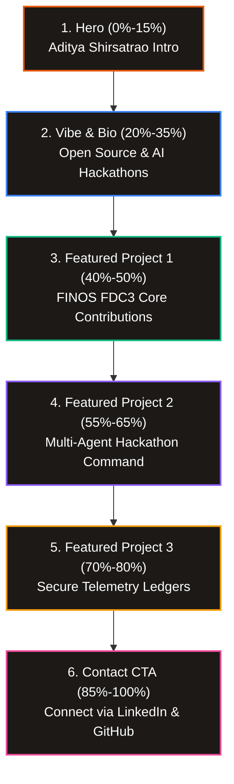

# Implementation Plan: Immersive 6-Beat Scrollytelling Portfolio

We will re-engineer the portfolio to merge the static **Projects Bento Grid** directly into the **Scrollytelling Canvas sequence** (Option B). This creates a single seamless, cinematic narrative from top to bottom. All content will be personalized using your real GitHub contribution history, Lablab.ai hackathon work, and security research profile.

---

## The 6-Beat Narrative Flow (1000vh Scroll Depth)

*   **Beat 1: The Identity (0% – 15%):** Letters slide up staggered: *"ADITYA SHIRSATRAO — Creative Tech & Open-Source Engineer"*.
*   **Beat 2: The Biography (20% – 35%):** Glassmorphic card detailing your profile: open-source contributor to `FINOS` and `DjangoCRM`, AI Developer at `Lablab.ai` hackathons, and security analyst.
*   **Beat 3: Project 1 - FINOS FDC3 API (40% – 50%):** Slides into view over the canvas. Highlights your contributions to standardizing API signatures and codebase maintainability in financial messaging.
*   **Beat 4: Project 2 - AI Agent Command Center (55% – 65%):** Slides into view. Focuses on orchestrating TypeScript agents, vector search interfaces, and tool execution.
*   **Beat 5: Project 3 - DjangoCRM Telemetry (70% – 80%):** Focuses on unit test automation, search filters, and fixing data vulnerabilities.
*   **Beat 6: The Connection (85% – 100%):** A terminal-style booking card linking directly to your LinkedIn and GitHub profiles.

---

## Proposed Changes

### 1. `components/ScrollyCanvas.tsx`
*   Extend total scroll-track length inside the component parent container from `500vh` to `1000vh` to allow comfortable reading beats.

### 2. `components/Overlay.tsx`
*   Re-engineer the overlay layers using Framer Motion transforms to animate the 6 distinct steps sequentially.
*   Remove the static bottom `Projects.tsx` component and fold its grid styling into the scrolly steps (`Beat 3`, `Beat 4`, `Beat 5`).
*   Include click-functional call-to-actions linking to `https://github.com/adityashirsatrao007` and `https://www.linkedin.com/in/adityashirsatrao/`.

---

## Verification Plan

### Automated Checks
*   Verify that `npm run build` compiles with 0 typescript errors.

### Manual Verification
*   Confirm scroll timing feels comfortable and legible across the expanded `1000vh` page track.
