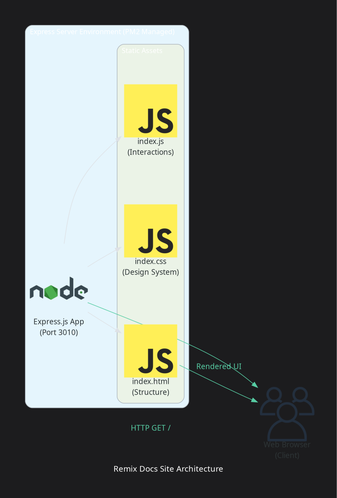
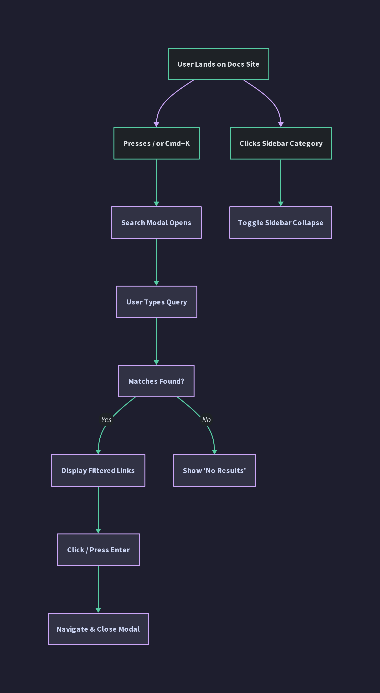

# Remix Docs Site

A premium, framework-less developer documentation site for the Remix framework, designed with the clinical dark luxury monospace brand identity.

## Features
- **Design Tokens**: Standardized CSS custom properties for dark luxury aesthetics.
- **Micro-interactions**: Command palette modal (`Cmd+K` or `/`), collapsible folders sidebar, IntersectionObserver scrollspy, and copy-to-clipboard code blocks.
- **Spotlight Cards**: Proximity-based radial hover effects on dashboard items.
- **Production Standards**: Express.js server featuring CORS control, strict security headers (CSP, HSTS, X-Frame-Options, X-Content-Type-Options), telemetry endpoints (`/health` and `/ready`), and graceful shutdown handles.
- **Persistent Management**: Production server daemonized using PM2.

## Architecture



## Interaction Flow



## Getting Started

### Local Setup
1. Install dependencies:
   ```bash
   npm install
   ```

2. Run the dev server:
   ```bash
   make dev
   ```

3. Open [http://localhost:3010](http://localhost:3010) in your browser.

### Commands
- `make dev` / `make start`: Run Node server in dev/production modes
- `make ci`: Run linting, validation checks, and health tests
- `make diagrams`: Re-render all project diagrams

### Telemetry Check
- `/health`: System status monitoring
- `/ready`: Server database/downstream connection checks
